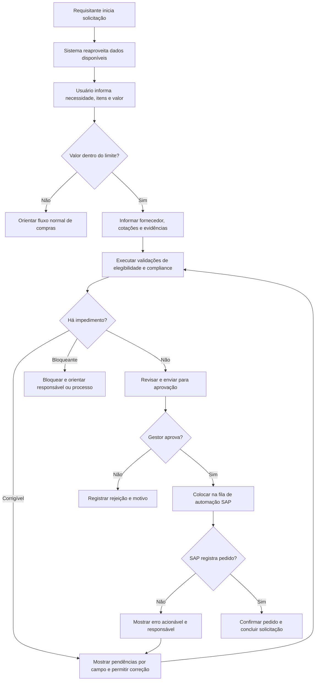

# PRD Design - SESI | MVP Pequenas Compras

**Status:** especificação inicial de experiência para prototipação e validação  
**Data:** 2026-06-09  
**Produto:** módulo de Pequenas Compras no Base-b  
**Cliente:** SESI  
**Escopo:** UX, UI, arquitetura da informação e fluxos do MVP  
**Documentos de referência:** PRD, User Stories e Decisões Pendentes do MVP

## 1. Objetivo deste documento

Este PRD Design traduz os requisitos funcionais, regras de negócio e User Stories do projeto em uma especificação de experiência utilizável por UX, UI, produto e desenvolvimento.

O documento define:

- personas e responsabilidades;
- jobs-to-be-done;
- arquitetura da informação;
- navegação e permissões;
- modelo de estados da solicitação;
- fluxos principais e de exceção;
- inventário e comportamento das telas;
- padrões de formulário, validação e feedback;
- requisitos de acessibilidade e responsividade;
- critérios de aceite de design;
- plano de prototipação e validação com usuários.

Este documento não substitui o PRD funcional. Em caso de conflito, prevalece a seguinte hierarquia:

1. requisitos e regras aprovados no PRD;
2. decisões formalmente confirmadas pelo SESI;
3. User Stories e critérios de aceite;
4. hipóteses de UX registradas neste documento;
5. benchmarking como referência, nunca como regra automática para o SESI.

## 2. Visão de experiência

O módulo de Pequenas Compras deve permitir que uma pessoa solicite, acompanhe, aprove, corrija ou audite uma compra sem precisar compreender a estrutura interna do SAP.

A experiência deve se comportar como uma camada de:

- orientação;
- prevenção de erros;
- aplicação transparente das regras;
- coordenação entre perfis;
- rastreabilidade do processo.

### Promessa de experiência

> O usuário sempre deve saber onde a solicitação está, por que ela está nesse estado e qual é a próxima ação possível.

### Macroapostas de design

| Prioridade | Objetivo | Implicação para o design |
| --- | --- | --- |
| Precisão | Evitar compras fora das regras | Validações contextuais, resumo antes do envio e bloqueios explicados |
| Eficiência | Reduzir trabalho repetitivo | Reaproveitamento de dados, rascunho automático e filas orientadas à ação |
| Transparência | Eliminar estados obscuros | Status legíveis, histórico cronológico e responsável atual visível |
| Recuperação | Reduzir retrabalho após falhas | Mensagens acionáveis, correção localizada e reenvio sem perda do histórico |
| Governança | Preservar compliance e auditoria | Permissões por papel, decisões registradas e regras identificáveis |

## 3. Princípios de design

### 3.1 Orientar antes de bloquear

O sistema deve prevenir erros com ajuda, exemplos e restrições adequadas. Quando um bloqueio for necessário, deve explicar:

1. o que foi identificado;
2. por que a solicitação não pode continuar;
3. quem pode resolver;
4. qual é a próxima ação.

### 3.2 Uma solicitação, uma fonte de verdade

Solicitações, aprovações, pendências, integrações e auditoria são diferentes visões do mesmo objeto. A interface não deve duplicar registros nem criar versões concorrentes da solicitação.

### 3.3 Mostrar complexidade somente quando necessária

O requisitante não deve visualizar campos administrativos, detalhes técnicos do SAP ou regras que não possa alterar. Informações adicionais devem surgir de acordo com:

- valor;
- tipo de item;
- situação do fornecedor;
- quantidade de cotações;
- resultado das validações;
- papel do usuário.

### 3.4 Reconhecimento em vez de memorização

O sistema deve oferecer opções válidas, exemplos, dados sugeridos e contexto. Não deve exigir que o usuário memorize códigos de contrato, regras, centros de custo ou procedimentos externos.

### 3.5 Status é comunicação, não decoração

Todo status deve indicar posição no processo e ação esperada. Cor nunca será o único diferenciador; status deve usar texto, ícone e tratamento visual coerente.

### 3.6 Rastreabilidade sem poluir a tarefa

O histórico completo deve existir, mas não competir com a ação principal. A tela deve apresentar um resumo operacional e permitir aprofundamento no histórico quando necessário.

### 3.7 Decisões de risco exigem contexto

Aprovar, rejeitar, alterar regra e liberar exceções não podem ser ações rápidas sem revisão. O usuário deve visualizar as informações essenciais antes de confirmar.

## 4. Perfis, personas e stakeholders

Fornecedor não é persona da aplicação no MVP, pois não acessará diretamente o Base-b. Ele permanece como entidade de negócio e stakeholder indireto.

### 4.1 Persona primária - Requisitante

**Arquétipo:** colaborador de uma unidade que precisa resolver uma necessidade operacional de baixo valor.

**Objetivos:**

- abrir uma solicitação rapidamente;
- saber se a compra se enquadra no fluxo;
- entender quais documentos são necessários;
- acompanhar o andamento sem acessar o SAP;
- corrigir pendências sem reiniciar o processo.

**Comportamentos e contexto:**

- utiliza o processo de forma eventual;
- pode desconhecer regras de compras;
- conhece a necessidade, mas não necessariamente a classificação administrativa;
- pode acessar pelo computador corporativo ou celular;
- tende a abandonar o fluxo quando a mensagem não indica a próxima ação.

**Dores:**

- formulários longos e linguagem técnica;
- repetir informações já conhecidas pelo SESI;
- anexar documentos sem saber qual evidência corresponde a qual preço;
- receber mensagens genéricas de bloqueio;
- não saber quem está com a solicitação.

**Tarefas críticas:**

- criar e salvar rascunho;
- preencher a necessidade;
- selecionar ou informar fornecedor;
- registrar cotações e evidências quando necessário;
- enviar para aprovação;
- corrigir e reenviar;
- acompanhar status e pedido SAP.

**Critério de sucesso:** concluir a solicitação correta na primeira tentativa ou compreender imediatamente como corrigir uma pendência.

### 4.2 Persona primária - Gestor aprovador

**Arquétipo:** responsável por validar necessidade, orçamento e prioridade das solicitações da sua equipe.

**Objetivos:**

- identificar rapidamente o que aguarda sua decisão;
- compreender necessidade, valor, fornecedor e riscos;
- aprovar ou rejeitar com segurança;
- evitar aprovações sem evidência suficiente.

**Comportamentos e contexto:**

- possui pouco tempo para analisar cada solicitação;
- acessa uma fila de decisões;
- pode aprovar pelo computador ou celular;
- precisa diferenciar pendência operacional de decisão gerencial.

**Dores:**

- informação fragmentada;
- anexos sem relação clara com a cotação;
- ausência de resumo;
- ações de aprovação próximas de ações secundárias;
- falta de justificativa de rejeição no histórico.

**Tarefas críticas:**

- consultar solicitações atribuídas;
- comparar resumo e evidências;
- aprovar;
- rejeitar informando motivo;
- consultar decisões anteriores.

**Critério de sucesso:** tomar a decisão sem precisar abrir sistemas externos ou solicitar esclarecimentos básicos fora da aplicação.

### 4.3 Persona primária - Comprador ou analista de Suprimentos

**Arquétipo:** profissional responsável pela operação, exceções e governança cotidiana de pequenas compras.

**Objetivos:**

- reduzir trabalho manual repetitivo;
- priorizar exceções e impedimentos;
- identificar gargalos;
- validar fornecedor, cotações e aderência às regras;
- acompanhar a criação dos pedidos no SAP.

**Comportamentos e contexto:**

- utiliza a aplicação diariamente;
- trabalha com filas e grande volume;
- precisa filtrar, ordenar e comparar solicitações;
- necessita de contexto sem abrir cada registro;
- atua como apoio quando o requisitante não consegue resolver.

**Dores:**

- filas sem prioridade;
- status genéricos;
- retrabalho por anexos incompletos;
- dados espalhados em sistemas;
- erros técnicos apresentados sem categorização.

**Tarefas críticas:**

- monitorar fila operacional;
- revisar exceções;
- verificar solicitações bloqueadas;
- acompanhar erros SAP;
- orientar correções;
- consultar indicadores.

**Critério de sucesso:** concentrar esforço humano apenas nas solicitações que realmente exigem análise ou intervenção.

### 4.4 Persona de controle - Compliance e Auditoria

**Arquétipo:** profissional que verifica aderência às regras e reconstrói decisões.

**Objetivos:**

- localizar bloqueios, exceções e justificativas;
- compreender por que uma regra foi acionada;
- consultar versões anteriores;
- verificar atores, datas e integrações;
- analisar indícios de fracionamento.

**Comportamentos e contexto:**

- trabalha prioritariamente em leitura;
- precisa de filtros por período, regra, usuário e resultado;
- pode consultar eventos muito tempo depois da solicitação;
- não deve alterar o histórico.

**Dores:**

- logs técnicos sem linguagem de negócio;
- ausência de vínculo entre evento e regra;
- registros sobrescritos;
- filtros insuficientes;
- permissões excessivas.

**Tarefas críticas:**

- consultar trilha cronológica;
- filtrar eventos;
- abrir evidências relacionadas;
- identificar versão e origem da alteração;
- acompanhar bloqueios de compliance.

**Critério de sucesso:** reconstruir o ciclo da solicitação sem depender de explicação verbal dos envolvidos.

### 4.5 Persona de gestão - Gestor de Compras ou Suprimentos

**Arquétipo:** responsável por desempenho operacional, SLA, capacidade e resultados do piloto.

**Objetivos:**

- acompanhar volume e gargalos;
- identificar regras que mais bloqueiam;
- medir retrabalho e erros de automação;
- avaliar ganho operacional;
- decidir expansão ou ajuste do piloto.

**Tarefas críticas:**

- consultar indicadores;
- filtrar por período, unidade e centro de custo;
- analisar tendência;
- abrir a lista que compõe um indicador;
- acompanhar SLA.

**Critério de sucesso:** transformar indicadores em decisões operacionais sem precisar montar relatórios paralelos.

### 4.6 Persona administrativa - TI ou administrador autorizado

**Arquétipo:** profissional responsável pela sustentação, integrações e parâmetros autorizados.

**Objetivos:**

- acompanhar saúde das integrações;
- alterar parâmetros permitidos;
- preservar histórico das configurações;
- diagnosticar falhas sem expor detalhes técnicos ao requisitante.

**Tarefas críticas:**

- consultar tentativas de integração;
- reprocessar apenas quando permitido;
- ajustar parâmetros configuráveis;
- revisar alterações;
- acompanhar disponibilidade das fontes.

**Critério de sucesso:** manter o MVP operacional sem alterar código para ajustes previstos e sem comprometer governança.

## 5. Jobs-to-be-done

| Persona | Situação | Motivação | Resultado esperado |
| --- | --- | --- | --- |
| Requisitante | Precisa adquirir um item ou serviço de baixo valor | Registrar a necessidade com o mínimo de retrabalho | Enviar uma solicitação válida e acompanhar sua conclusão |
| Requisitante | Recebe uma pendência | Compreender e corrigir apenas o necessário | Reenviar sem perder dados ou histórico |
| Gestor | Possui solicitações aguardando decisão | Avaliar rapidamente risco, necessidade e valor | Aprovar ou rejeitar com segurança |
| Compras | Inicia a rotina operacional | Priorizar exceções e falhas | Atuar primeiro no que bloqueia o processo |
| Compliance | Investiga um bloqueio ou exceção | Reconstruir regras e decisões | Confirmar aderência e evidências |
| Gestor de operação | Avalia o piloto | Identificar gargalos e ganho | Ajustar processo e capacidade |
| TI | Integração falha | Diagnosticar origem e possibilidade de reprocessamento | Restaurar operação sem corromper o pedido |

## 6. Modelo de permissões

As permissões devem ser aplicadas no dado e na ação, não apenas escondendo componentes da interface.

| Capacidade | Requisitante | Gestor | Compras/Suprimentos | Compliance/Auditoria | Gestão | TI/Admin |
| --- | --- | --- | --- | --- | --- | --- |
| Criar solicitação | Sim | Conforme perfil acumulado | Sim | Não | Não | Não |
| Consultar solicitação própria | Sim | Sim, quando atribuída | Sim | Conforme autorização | Agregado ou leitura | Suporte autorizado |
| Editar rascunho | Próprio | Não | Conforme responsabilidade | Não | Não | Não |
| Corrigir pendência | Própria | Não | Conforme regra | Não | Não | Suporte excepcional |
| Aprovar ou rejeitar | Não | Atribuídas | Apenas se definido pelo processo | Exceção, se autorizado | Não | Não |
| Validar exceção | Não | Não | Sim | Sim, conforme regra | Não | Não |
| Consultar auditoria | Histórico próprio resumido | Decisões relacionadas | Sim | Sim, somente leitura | Agregado | Sim |
| Consultar indicadores | Próprios, se aplicável | Equipe, se aplicável | Sim | Conforme autorização | Sim | Saúde técnica |
| Alterar regras | Não | Não | Perfil autorizado | Perfil autorizado | Não | Perfil autorizado |
| Reprocessar integração | Não | Não | Solicitar reprocessamento | Não | Não | Perfil autorizado |

**A confirmar:** perfis definitivos, escopo de leitura, retenção e exportação da auditoria permanecem dependentes da `DEC-09`.

## 7. Entidade central da experiência

### 7.1 Solicitação de compra

A solicitação é o objeto principal e deve reunir:

- identificação;
- requisitante e unidade;
- centro de custo;
- descrição da necessidade;
- justificativa;
- urgência;
- itens e valor;
- fornecedor;
- cotações;
- evidências;
- validações;
- aprovação;
- tentativas de integração;
- pedido SAP;
- histórico.

### 7.2 Objetos relacionados

| Objeto | Relação | Uso na interface |
| --- | --- | --- |
| Item | Um ou mais por solicitação | Composição do valor e validação de estoque/contrato |
| Fornecedor | Principal e alternativas | Homologação, bloqueio e seleção |
| Cotação | Até 3 no fluxo de exceção | Comparação de preços e escolha |
| Evidência | Associada a uma cotação | Comprovação da origem |
| Validação | Várias por solicitação | Resultado de campos, regras e integrações |
| Aprovação | Uma ou mais decisões conforme política | Autorização e exceções |
| Evento de auditoria | Muitos por solicitação | Reconstrução cronológica |
| Tentativa SAP | Uma ou mais | Processamento, erro e reenvio |

## 8. Modelo de status

Os status devem refletir etapas compreensíveis pelo usuário. Validações transitórias, como “consultando fornecedor”, devem aparecer como estado de processamento e não como status persistente.

| Código técnico sugerido | Texto no produto | Significado | Ação principal |
| --- | --- | --- | --- |
| `draft` | Rascunho | Ainda não enviada | Continuar preenchimento |
| `needs_correction` | Correção necessária | Há pendência corrigível | Corrigir solicitação |
| `redirected` | Fora do fluxo de pequenas compras | Valor ou regra direcionou para outro processo | Acessar orientação |
| `blocked` | Bloqueada | Regra impede continuidade e exige análise | Consultar motivo |
| `awaiting_approval` | Aguardando aprovação | Pronta para decisão gerencial | Aprovar ou rejeitar |
| `rejected` | Rejeitada | Gestor encerrou o fluxo | Consultar motivo |
| `approved` | Aprovada | Autorizada, aguardando automação | Acompanhar |
| `queued_for_sap` | Na fila do SAP | Aguardando execução programada | Acompanhar |
| `processing_sap` | Registrando no SAP | Integração em andamento | Aguardar |
| `integration_error` | Erro no registro | SAP ou automação retornou falha | Corrigir ou solicitar intervenção |
| `completed` | Pedido criado | SAP confirmou o pedido | Consultar pedido |

### Regras de apresentação dos status

- Não usar apenas cor.
- Exibir texto completo em telas de detalhe.
- Em tabelas, usar badge com texto e ícone.
- Exibir responsável atual ou área responsável junto do status.
- Separar status da solicitação de resultado de validação.
- Não usar “Erro” sem informar se é corrigível pelo requisitante, por Compras ou por TI.

## 9. Arquitetura da informação

### 9.1 Navegação principal

A navegação deve ter no máximo seis grupos operacionais visíveis por perfil:

1. **Visão geral**
2. **Solicitações**
3. **Aprovações**
4. **Auditoria**
5. **Indicadores**
6. **Administração**

Itens não autorizados não devem aparecer.

### 9.2 Estrutura recomendada

```text
Visão geral

Solicitações
  Minhas solicitações
  Todas as solicitações
  Correção necessária
  Bloqueadas
  Erros de integração

Aprovações
  Aguardando minha decisão
  Decididas por mim

Auditoria
  Eventos
  Bloqueios e exceções

Indicadores
  Operação
  SLA e automação

Administração
  Regras
  Integrações
  Perfis e acesso
```

“Pendências” não deve ser uma entidade separada. Deve ser uma visualização filtrada de Solicitações, acessível por atalho quando for relevante ao papel.

### 9.3 Navegação contextual

Na tela de detalhe, utilizar até seis abas:

1. Visão geral
2. Cotações e evidências
3. Validações
4. Aprovação
5. Integração SAP
6. Histórico

As abas devem:

- refletir a URL para permitir link direto;
- manter estado ao recarregar;
- exibir indicador quando houver pendência;
- respeitar permissão;
- evitar abas dentro de abas.

## 10. Rotas conceituais

| Rota | Tela | Acesso principal |
| --- | --- | --- |
| `/` | Visão geral orientada ao papel | Todos |
| `/solicitacoes` | Lista de solicitações | Todos, com escopo por perfil |
| `/solicitacoes/nova` | Nova solicitação | Requisitante e perfis autorizados |
| `/solicitacoes/$id` | Detalhe da solicitação | Conforme vínculo e permissão |
| `/solicitacoes/$id/corrigir` | Correção orientada | Responsável pela correção |
| `/aprovacoes` | Fila de aprovação | Gestor e aprovadores adicionais |
| `/auditoria` | Consulta de eventos | Perfis autorizados |
| `/indicadores` | BI operacional | Gestão e áreas autorizadas |
| `/administracao/regras` | Parâmetros configuráveis | Administradores autorizados |
| `/administracao/integracoes` | Saúde e tentativas | TI e suporte autorizado |

Filtros, paginação, ordenação e aba ativa devem ser preservados na URL quando fizer sentido.

## 11. Fluxo macro do usuário



## 12. Fluxo de criação da solicitação

O formulário é complexo e não deve ser implementado em drawer. Deve usar página completa com stepper, rascunho automático e revisão final.

### 12.1 Etapas

| Etapa | Objetivo | Conteúdo principal |
| --- | --- | --- |
| 1. Enquadramento | Saber cedo se a compra pertence ao fluxo | Unidade, centro de custo, natureza, urgência e valor estimado |
| 2. Necessidade | Registrar contexto suficiente | Descrição, justificativa, itens, quantidade e valor |
| 3. Fornecedor e preços | Definir fluxo homologado ou exceção | Fornecedor, situação, até 3 cotações e escolha |
| 4. Evidências e conformidade | Completar requisitos obrigatórios | Anexos, data/hora, justificativa fora do menor preço e validações |
| 5. Revisão e envio | Evitar envio incorreto | Resumo completo, pendências e confirmação |

### 12.2 Comportamento

- Mostrar todas as etapas desde o início.
- Permitir voltar sem perder dados.
- Salvar rascunho automaticamente.
- Exibir “Salvando”, “Salvo” ou “Falha ao salvar”.
- Validar campos simples ao sair do campo.
- Executar validações assíncronas com feedback visível.
- Validar relações entre campos ao avançar.
- Exibir resumo de pendências antes do envio.
- Não limpar dados quando uma validação falhar.
- Avisar antes de sair quando houver alteração ainda não salva.

### 12.3 Enquadramento acima do limite

Quando o valor ultrapassar o limite:

- interromper as etapas de pequenas compras;
- preservar os dados já informados;
- explicar que a solicitação não se enquadra;
- mostrar o limite vigente;
- orientar o fluxo normal;
- registrar o evento;
- não usar mensagem de erro, pois se trata de direcionamento de processo.

## 13. Fluxos de fornecedor e cotações

### 13.1 Fornecedor homologado

1. Usuário pesquisa e seleciona fornecedor.
2. Sistema verifica situação.
3. Sistema mostra resultado: homologado, bloqueado, inexistente ou indisponível.
4. Fornecedor homologado não elimina outras validações.
5. Usuário continua para evidências e revisão.

### 13.2 Fornecedor bloqueado

- Exibir alerta persistente junto ao fornecedor.
- Informar que o pedido não poderá ser automatizado.
- Não permitir envio para aprovação.
- Mostrar responsável ou canal de orientação.
- Registrar regra, data e resultado no histórico.
- Não oferecer botão genérico “Tentar novamente” quando o bloqueio for de negócio.

### 13.3 Ausência de fornecedor homologado

O fluxo deve mudar para “Exceção de fornecedor” e apresentar:

- explicação resumida;
- responsável atual pela inserção das cotações;
- até três blocos repetíveis de preço;
- fornecedor ou identificação da fonte;
- valor;
- data e hora de coleta;
- evidência obrigatória;
- seleção do fornecedor escolhido;
- justificativa obrigatória quando não for o menor preço.

Cada evidência deve ficar visualmente associada à respectiva cotação. Não utilizar uma lista única de anexos sem vínculo.

**A confirmar:** responsável pela inserção e aprovação adicional seguem `DEC-05` e `DEC-06`.

## 14. Fluxos de compliance

### 14.1 Item de estoque

- Mostrar o resultado assim que houver fonte confiável.
- Impedir continuidade como pequena compra.
- Exibir orientação operacional.
- Não apresentar contrato ou estoque como erro técnico.

**A confirmar:** destino final segue `DEC-01`.

### 14.2 Contrato vigente

- Informar que existe um contrato aplicável.
- Exibir somente os dados permitidos.
- Orientar utilização do contrato ou contato responsável.
- Preservar a solicitação como registro do direcionamento.

**A confirmar:** dados exibidos seguem `DEC-02`.

### 14.3 Possível fracionamento

- Usar linguagem “possível fracionamento” até análise humana.
- Informar quais dimensões contribuíram para a sinalização quando permitido.
- Não acusar fraude.
- Bloquear envio ao SAP.
- Direcionar para análise responsável.
- Manter evidências e histórico imutáveis.

**A confirmar:** critérios e tratamento seguem `DEC-03` e `DEC-04`.

## 15. Fluxo de aprovação

### 15.1 Fila

A fila deve mostrar:

- ID;
- necessidade resumida;
- requisitante;
- unidade;
- valor;
- fornecedor;
- status de conformidade;
- tempo aguardando;
- data de envio.

Filtros mínimos:

- período;
- unidade;
- valor;
- urgência;
- fornecedor;
- conformidade;
- tempo aguardando.

### 15.2 Detalhe para decisão

Antes das ações, mostrar:

1. necessidade e justificativa;
2. valor total;
3. itens;
4. fornecedor selecionado;
5. comparação das cotações;
6. justificativa quando não for menor preço;
7. resumo das validações;
8. anexos essenciais.

### 15.3 Aprovar

- A aprovação deve ocorrer no detalhe.
- Solicitar confirmação simples.
- Informar que a solicitação seguirá para automação SAP.
- Desabilitar a ação durante processamento.
- Mostrar confirmação persistente e atualizar status.
- Registrar ator e data/hora.

### 15.4 Rejeitar

- Abrir dialog focado na decisão.
- Exibir motivos estruturados e campo complementar.
- Não perder o contexto da solicitação.
- Informar que a rejeição encerra o fluxo atual.
- Registrar decisão, motivo, ator e data/hora.

**A confirmar:** obrigatoriedade e formato seguem `DEC-07`.

### 15.5 Ações em massa

O MVP não deve permitir aprovação, rejeição ou exclusão em massa. O risco e a necessidade de contexto superam o ganho de velocidade.

## 16. Fluxo de integração SAP

### 16.1 Estados visíveis

- Aprovada;
- Na fila do SAP;
- Registrando no SAP;
- Pedido criado;
- Erro no registro.

### 16.2 Processamento longo

Como a automação pode ser agendada:

- não bloquear a interface;
- informar a próxima janela quando conhecida;
- mostrar última atualização;
- permitir que o usuário saia da tela;
- atualizar status ao receber retorno;
- não usar spinner contínuo por longos períodos.

### 16.3 Sucesso

Mostrar:

- número ou referência do pedido, quando disponível;
- data e hora;
- mensagem de conclusão;
- acesso ao histórico;
- nenhuma necessidade de acesso direto ao SAP pelo requisitante.

### 16.4 Falha

Classificar a falha para a interface:

| Tipo | Exemplo | Responsável visível | Ação |
| --- | --- | --- | --- |
| Dado corrigível | Anexo ou fornecedor divergente | Requisitante ou Compras | Corrigir solicitação |
| Regra de negócio | Bloqueio identificado na revalidação | Compras/Compliance | Consultar impedimento |
| Integração técnica | SAP indisponível ou timeout | TI | Aguardar ou solicitar reprocessamento |
| Indeterminado | Falha sem causa compreensível | TI/Compras | Abrir intervenção |

Mensagens para usuário não devem exibir stack trace, payload, endpoint ou código técnico isolado.

**A confirmar:** frequência de execução segue `DEC-08`.

## 17. Fluxo de correção e reenvio

1. Usuário abre solicitação com “Correção necessária”.
2. Sistema mostra resumo das pendências no topo.
3. Cada pendência leva ao campo ou seção correspondente.
4. Campos sem relação com a pendência permanecem preservados.
5. Usuário corrige e salva.
6. Sistema reexecuta todas as regras aplicáveis.
7. Usuário revisa alterações.
8. Solicitação retorna à etapa adequada.
9. Histórico anterior permanece disponível.

O sistema deve diferenciar:

- **corrigir**, quando o usuário possui ação possível;
- **aguardar análise**, quando depende de outra área;
- **encerrada**, quando o processo não pode continuar.

## 18. Fluxo de auditoria

### 18.1 Lista de eventos

Filtros mínimos:

- solicitação;
- período;
- ator;
- tipo de evento;
- regra;
- resultado;
- integração.

### 18.2 Linha do tempo

Cada evento deve apresentar:

- data e hora;
- ator ou origem automática;
- ação;
- entidade ou campo;
- valor anterior, quando aplicável;
- novo valor;
- regra associada;
- resultado;
- vínculo com evidência ou tentativa SAP.

Eventos automáticos devem ser identificados como “Sistema”, “Motor de regras” ou “Integração SAP”, não como usuário humano.

### 18.3 Restrições

- Somente leitura.
- Sem edição ou exclusão.
- Dados anteriores não devem ser substituídos.
- Exportação somente se aprovada.
- Informações sensíveis devem respeitar escopo do perfil.

## 19. Dashboard e indicadores

O dashboard deve ser uma ferramenta operacional, sem hero, composição promocional ou excesso de cards.

### 19.1 Visão do requisitante

- solicitações em andamento;
- correções necessárias;
- aguardando aprovação;
- pedidos concluídos;
- atalho para nova solicitação.

### 19.2 Visão do comprador

- volume recebido;
- fila de exceções;
- bloqueios por regra;
- erros SAP;
- solicitações próximas ou acima do SLA;
- atividades recentes relevantes.

### 19.3 Visão do gestor

- volume por período;
- elegíveis versus bloqueadas;
- SLA até aprovação;
- SLA aprovação até SAP;
- pedidos criados;
- falhas da automação;
- retrabalho;
- ganho operacional estimado.

### 19.4 Interação

- Todo indicador deve permitir abrir a lista que o compõe.
- Filtros globais devem permanecer ao navegar para o detalhamento.
- Gráficos devem ter resumo textual e tabela acessível.
- Não usar gráficos apenas decorativos.
- Atualização e período de referência devem estar visíveis.

**A confirmar:** cálculo e configuração mínima seguem `DEC-10` e `DEC-11`.

## 20. Administração de regras

### 20.1 Regras configuráveis no MVP

Hipótese inicial:

- limite máximo de pequenas compras;
- quantidade mínima de cotações.

Demais regras devem permanecer em configuração técnica auditável até confirmação.

### 20.2 Padrão de alteração

1. Exibir valor atual e data de vigência.
2. Explicar impacto da regra.
3. Solicitar novo valor.
4. Exibir resumo “antes e depois”.
5. Solicitar confirmação.
6. Registrar ator, data/hora, valor anterior e novo valor.
7. Aplicar somente a novas validações.
8. Não reescrever solicitações já processadas.

**A confirmar:** lista e perfis seguem `DEC-12`.

## 21. Inventário de telas

| Tela | Objetivo | Componentes principais | Reaproveitamento do template |
| --- | --- | --- | --- |
| Visão geral | Orientar rotina por papel | KPIs, listas prioritárias, gráficos e atalhos | Dashboard, cards, tabs e Recharts |
| Solicitações | Localizar e priorizar registros | Data table, filtros, paginação e colunas | Feature `tasks` e data-table |
| Nova solicitação | Criar pedido válido | Stepper, forms, uploads e resumo | Forms shadcn; nova composição em página |
| Detalhe | Compreender estado e agir | Cabeçalho, status, abas, timeline e ações | Tabs, badges, alerts e dialogs |
| Correção | Resolver pendências | Resumo de erros, formulário focado e revisão | Forms, alerts e links de âncora |
| Aprovações | Tomar decisão | Fila, resumo, anexos e dialog de rejeição | Table, sheet para preview e dialogs |
| Auditoria | Reconstruir processo | Filtros e timeline | Data table, collapsible e scroll area |
| Indicadores | Gerir operação | KPIs, gráficos e drill-down | Dashboard e Recharts |
| Regras | Alterar parâmetros autorizados | Form, diff e confirmação | Settings, forms e confirm dialog |
| Integrações | Acompanhar saúde técnica | Status, tentativas e detalhes | Apps, badges e tables |

## 22. Padrões de componentes

### 22.1 Tabelas

- Paginação, não rolagem infinita.
- Total de resultados visível.
- Busca por ID, descrição, requisitante ou fornecedor.
- Filtros refletidos na URL.
- Colunas configuráveis somente quando houver ganho real.
- Linha inteira clicável para abrir detalhe.
- Ações secundárias em menu.
- Nenhuma ação crítica apenas no menu de contexto.
- Estado vazio específico para primeiro uso, sem resultado e falha de carregamento.

### 22.2 Cards

Usar somente para:

- indicadores;
- resumo de cotação repetível;
- itens repetidos;
- integrações.

Não colocar seções inteiras da página em cards e não aninhar cards.

### 22.3 Drawers e sheets

Usar para:

- consulta rápida;
- filtros em mobile;
- detalhes secundários;
- anexos;
- preview sem decisão.

Não usar para:

- nova solicitação completa;
- correção complexa;
- aprovação definitiva;
- configuração de múltiplas regras.

### 22.4 Dialogs

Usar para:

- confirmar aprovação;
- rejeitar com motivo;
- confirmar alteração de regra;
- avisar perda de alterações.

Não usar para apresentar erros corrigíveis de formulário.

### 22.5 Badges

Badges devem representar:

- status;
- severidade;
- situação do fornecedor;
- resultado de validação.

Não usar badges para textos longos ou ações.

## 23. Formulários e entrada de dados

### 23.1 Estrutura

- Uma coluna como padrão.
- Duas colunas apenas para campos curtos e relacionados.
- Label sempre visível acima do campo.
- Obrigatoriedade indicada em texto e sem depender apenas de asterisco.
- Helper text somente quando evitar erro.
- Campos condicionais revelados após a decisão que os ativa.

### 23.2 Validação

| Tipo | Momento |
| --- | --- |
| Formato monetário e data | Durante digitação ou ao sair |
| Obrigatoriedade | Ao sair e ao avançar |
| Consulta a fornecedor, estoque e contrato | Assíncrona, com debounce ou após seleção |
| Relação entre preços e anexos | Ao avançar |
| Menor preço e justificativa | Após selecionar fornecedor |
| Validação completa | Antes da revisão e do envio |

### 23.3 Uploads

- Informar formatos e tamanho permitido.
- Mostrar progresso individual.
- Associar arquivo à cotação correspondente.
- Permitir substituir antes do envio.
- Mostrar falha e opção de tentar novamente.
- Não considerar upload concluído antes da confirmação.
- Disponibilizar nome, tipo, tamanho e data.

### 23.4 Valores

- Usar formato monetário brasileiro.
- Calcular total automaticamente quando possível.
- Exibir valor total próximo da ação de continuar.
- Comparar com limite vigente sem exigir ação extra.
- Não permitir valores negativos ou quantidades inválidas.

## 24. Feedback, estados e mensagens

### 24.1 Hierarquia de feedback

| Tipo | Componente | Uso |
| --- | --- | --- |
| Campo inválido | Mensagem inline | Correção localizada |
| Pendência de seção | Alert dentro da seção | Vários campos relacionados |
| Bloqueio de negócio | Banner persistente | Regra impede continuidade |
| Sucesso simples | Toast | Rascunho salvo ou alteração concluída |
| Processo longo | Estado no registro | Integração SAP |
| Falha crítica | Alert ou página de erro | Serviço indisponível ou perda de acesso |

### 24.2 Estrutura de mensagem

**Problema + motivo + próxima ação**

Exemplos:

- “Anexe a evidência desta cotação para continuar.”
- “Este fornecedor está bloqueado para compras. Selecione outro fornecedor ou contate Suprimentos.”
- “A solicitação ultrapassa o limite de R$ 3.000,00 e deve seguir pelo fluxo normal de compras.”
- “O pedido não foi criado no SAP porque o fornecedor diverge da solicitação aprovada. Revise os dados ou solicite apoio de Compras.”

### 24.3 Estados obrigatórios por tela

- carregando;
- carregado;
- vazio;
- sem resultado;
- erro recuperável;
- erro sem ação do usuário;
- sem permissão;
- dado desatualizado;
- salvando;
- salvo;
- alteração não salva;
- operação concluída.

## 25. Conteúdo e linguagem

### 25.1 Tom

- direto;
- institucional;
- respeitoso;
- orientado à ação;
- sem culpar o usuário;
- sem jargão de integração.

### 25.2 Vocabulário oficial

Usar:

- Solicitação;
- Pequena compra;
- Requisitante;
- Gestor aprovador;
- Compras;
- Suprimentos;
- Cotação;
- Evidência;
- Validação;
- Correção necessária;
- Pedido SAP.

Evitar na interface:

- ticket;
- task;
- job;
- payload;
- endpoint;
- exception;
- status code;
- erro 500;
- processar novamente sem contexto.

### 25.3 Rótulos de ação

Preferir verbos específicos:

- Salvar rascunho;
- Continuar;
- Revisar solicitação;
- Enviar para aprovação;
- Aprovar solicitação;
- Rejeitar solicitação;
- Corrigir pendências;
- Reenviar;
- Consultar histórico.

Evitar “Enviar”, “Confirmar” ou “OK” quando a consequência não estiver clara.

## 26. Direção visual

### 26.1 Conceito

**Clareza operacional silenciosa**

A interface deve parecer uma ferramenta de trabalho confiável: densa o suficiente para comparação, mas sem ruído visual.

### 26.2 Sistema

- Reaproveitar o shadcn-admin.
- Aplicar somente tema e fonte do preset definido.
- Preservar componentes customizados do template.
- Usar ícones Lucide.
- Manter raio de borda de até 8 px.
- Usar sombra apenas para sobreposição ou header sticky.
- Não usar gradientes, orbs ou ilustrações decorativas.
- Não usar hero ou composição de landing page.

### 26.3 Cor semântica

| Papel | Tratamento |
| --- | --- |
| Ação principal e informação | Cor primária do tema |
| Sucesso | Verde com ícone e texto |
| Atenção | Âmbar com ícone e explicação |
| Bloqueio ou erro | Vermelho com ícone e ação |
| Estado neutro | Cinza com texto |

As cores semânticas não devem substituir o texto.

### 26.4 Densidade

- Cabeçalhos compactos.
- Filtros próximos da tabela.
- Espaçamento de 8, 16 e 24 px como base.
- Títulos de painel menores que títulos de página.
- Conteúdo principal com largura suficiente para tabelas e formulários.
- Texto longo com medida confortável.

## 27. Responsividade

### Desktop

Contexto principal de Compras, Suprimentos, Auditoria, TI e gestão.

- Sidebar persistente e recolhível.
- Tabelas completas.
- Detalhe com abas.
- Filtros visíveis.

### Tablet

- Sidebar em drawer.
- Tabelas com prioridade de colunas.
- Filtros em sheet.
- Ações principais preservadas.

### Mobile

Uso prioritário por requisitante e gestor.

- Navegação off-canvas.
- Formulário em uma coluna.
- Stepper compacto com nome da etapa.
- Linhas de tabela transformadas em lista resumida.
- Botão principal persistente sem cobrir conteúdo.
- Aprovação disponível somente com resumo e evidências legíveis.
- Touch targets de pelo menos 44 px.

A interface deve funcionar a 320 px sem rolagem horizontal na navegação ou formulários. Tabelas operacionais podem usar visualização responsiva de linha, não apenas reduzir tipografia.

## 28. Acessibilidade

Meta mínima: WCAG 2.2 nível AA.

### Requisitos

- Operação completa por teclado.
- Ordem de foco conforme leitura.
- Foco visível.
- Escape fecha overlays e devolve foco ao acionador.
- Labels associados aos campos.
- Erros vinculados por `aria-describedby`.
- Mudanças de status anunciadas em região `aria-live`.
- Contraste mínimo de 4,5:1 para texto e 3:1 para componentes.
- Zoom de 200% sem perda de função.
- Ícones decorativos ocultos de tecnologia assistiva.
- Botões de ícone com nome acessível e tooltip quando necessário.
- Gráficos com resumo textual e dados equivalentes.
- Anexos com nome e ação acessíveis.
- Respeito a `prefers-reduced-motion`.

### Testes

- teclado;
- NVDA no Windows;
- contraste;
- zoom 200%;
- viewport de 320 px;
- leitura de erros e mudança de status.

## 29. Comportamento de busca e filtros

### Busca global

A busca do template deve localizar:

- solicitações por ID;
- descrição;
- requisitante;
- fornecedor;
- número de pedido SAP, quando disponível;
- comandos e destinos autorizados.

### Filtros

- Devem ser combináveis.
- Devem mostrar quantidade ativa.
- Devem possuir ação “Limpar filtros”.
- Devem persistir na URL.
- Voltar do detalhe deve restaurar lista, página e filtros.
- Sem resultado deve sugerir remover ou alterar filtros.

## 30. Notificações e atenção

No MVP, o produto deve garantir visibilidade dentro da aplicação. Canais externos, como e-mail ou Microsoft Teams, dependem de decisão posterior.

Eventos que exigem destaque:

- solicitação devolvida para correção;
- solicitação aguardando aprovação;
- solicitação rejeitada;
- pedido criado;
- erro no SAP;
- exceção aguardando análise;
- regra ou integração indisponível.

Notificações devem levar diretamente ao registro e à ação relacionada.

## 31. Hipóteses pendentes que afetam o design

| Decisão | Impacto de design |
| --- | --- |
| DEC-01 - destino de item de estoque | CTA e conteúdo do bloqueio |
| DEC-02 - dados do contrato | Campos visíveis e permissão |
| DEC-03 - detecção de fracionamento | Explicação da regra e dados necessários |
| DEC-04 - pós-bloqueio | Status, responsável e ações |
| DEC-05 - responsável pelas cotações | Permissões e fluxo da etapa 3 |
| DEC-06 - aprovação adicional | Número de etapas e linha do tempo |
| DEC-07 - motivo de rejeição | Componente e validação do dialog |
| DEC-08 - frequência SAP | Conteúdo de expectativa e status da fila |
| DEC-09 - auditoria | Navegação, filtros e exportação |
| DEC-10 - ganho operacional | Fórmula e conteúdo dos indicadores |
| DEC-11 - BI | Filtros, atualização e perfis |
| DEC-12 - regras configuráveis | Escopo da administração |

O protótipo deve usar as recomendações iniciais como hipótese claramente identificada, sem apresentá-las como decisão aprovada.

## 32. Métricas de experiência

| Métrica | Objetivo inicial |
| --- | --- |
| Taxa de conclusão da solicitação | Medir abandono e sucesso |
| Tempo mediano para enviar | Medir eficiência do formulário |
| Aprovação na primeira submissão | Medir qualidade da entrada |
| Solicitações devolvidas por campo ausente | Identificar falhas de orientação |
| Taxa de recuperação após pendência | Verificar clareza das mensagens |
| Tempo para decisão do gestor | Medir eficiência da aprovação |
| Erros de ação por perfil | Detectar problemas de permissão e compreensão |
| Uso de filtros e busca | Avaliar encontrabilidade |
| Chamados de suporte por motivo | Identificar linguagem ou fluxo confuso |
| Sucesso em testes de tarefa | Validar protótipo antes da implementação |

## 33. Plano de pesquisa e validação

### Rodada 1 - Arquitetura e fluxo

Participantes mínimos:

- 5 requisitantes;
- 3 gestores aprovadores;
- 3 profissionais de Compras/Suprimentos;
- 2 participantes de Compliance/Auditoria.

Tarefas:

1. abrir compra elegível com fornecedor homologado;
2. identificar que uma compra está acima do limite;
3. registrar exceção sem fornecedor homologado;
4. corrigir ausência de evidência;
5. aprovar e rejeitar uma solicitação;
6. interpretar um erro SAP;
7. reconstruir um bloqueio no histórico.

### Rodada 2 - Alta fidelidade

Validar:

- hierarquia;
- linguagem;
- densidade;
- feedback;
- responsividade;
- acessibilidade;
- entendimento dos status;
- compreensão das recomendações de compliance.

### Critérios de sucesso

- pelo menos 90% de conclusão nas tarefas principais;
- nenhum erro crítico sem recuperação;
- pelo menos 80% identifica corretamente a próxima ação;
- todos os participantes distinguem correção, bloqueio e espera;
- aprovação ou rejeição sem dúvida sobre a consequência;
- nenhuma dependência de instrução verbal para concluir o fluxo principal.

## 34. Entregáveis de design

1. Mapa de arquitetura da informação.
2. Fluxos macro e de exceção.
3. Wireframes desktop e mobile.
4. Protótipo navegável de alta fidelidade.
5. Biblioteca de padrões específicos do domínio.
6. Especificação de estados e conteúdo.
7. Matriz de permissões.
8. Relatório de testes de usabilidade.
9. Handoff com critérios de aceite.

### Fluxos obrigatórios no protótipo

- solicitação elegível;
- valor acima do limite;
- fornecedor bloqueado;
- item de estoque;
- contrato vigente;
- possível fracionamento;
- fornecedor não homologado;
- escolha fora do menor preço;
- aprovação;
- rejeição;
- erro SAP;
- correção e reenvio;
- consulta de auditoria.

## 35. Critérios de aceite de design

O PRD Design será atendido quando:

- cada persona acessar somente as funções coerentes com seu papel;
- a nova solicitação possuir entre 3 e 7 etapas e revisão final;
- rascunho e recuperação de dados estiverem definidos;
- todas as regras `RN-01` a `RN-14` possuírem comportamento visível;
- todos os cenários `CT-01` a `CT-12` estiverem representados no protótipo;
- cada tela possuir estados de carregamento, vazio, erro e sucesso;
- mensagens de bloqueio explicarem motivo e próxima ação;
- filtros e paginação forem preservados na navegação;
- aprovar, rejeitar e alterar regra exigirem contexto e confirmação;
- nenhum fluxo crítico depender exclusivamente de cor;
- o produto funcionar por teclado e em viewport de 320 px;
- o protótipo usar conteúdo realista em português;
- o design preservar padrões do shadcn-admin em vez de criar uma segunda biblioteca;
- decisões ainda pendentes permanecerem identificadas como hipótese.

## 36. Reaproveitamento do shadcn-admin

### Reutilizar diretamente

- sidebar e layout autenticado;
- header sticky;
- busca global e command menu;
- data table, filtros, paginação e visibilidade de colunas;
- dialogs e confirm dialog;
- sheets para consulta rápida e filtros mobile;
- tabs;
- alerts;
- badges;
- forms com React Hook Form e Zod;
- settings;
- páginas de erro;
- tema claro/escuro;
- skeletons e Sonner.

### Adaptar

- `Tasks` para `Solicitações`;
- dashboard para indicadores de compras;
- `Apps` para integrações;
- settings para regras autorizadas;
- users para gestão de perfis somente se permanecer no escopo;
- data models, textos, filtros e ações.

### Não reutilizar sem revisão

- bulk delete;
- aprovação em massa;
- formulários complexos em drawer;
- dados e textos genéricos do template;
- cards promocionais;
- páginas sem vínculo com o domínio;
- autenticação Clerk como decisão definitiva.

## 37. Diretrizes para implementação

O repositório-alvo é `DaniloAmaralUX/V2PequenasCompras`, baseado em Vite e shadcn-admin.

O workspace local onde esta documentação foi produzida utiliza Next.js e não deve ser tratado como base técnica do MVP.

Estrutura recomendada:

```text
src/features/purchase-requests
  components
  data
  schemas
  hooks
  services
  index.tsx

src/features/approvals
src/features/audit
src/features/analytics
src/features/rules
src/features/integrations
```

Regras de handoff:

- interface em português;
- nomes técnicos consistentes em inglês;
- schemas Zod como fonte de tipos;
- regras de negócio fora de componentes visuais;
- integrações isoladas por adaptadores;
- filtros de tabela validados na rota;
- componentes do template compostos antes de criar novos;
- testes com role, label e texto visível;
- conteúdo de erro mantido em catálogo central.

## 38. Fora do escopo de design do MVP

- portal de fornecedor;
- busca automática de preços online;
- homologação completa de fornecedor;
- penalidade automática por fracionamento;
- BI altamente personalizável;
- auditoria preventiva em tempo real;
- configuração de todas as regras pela interface;
- aprovação em massa;
- inteligência artificial;
- migração para Next.js;
- substituição do processo normal de compras.

## 39. Fontes

### Produto

- `docs/prd-pequenas-compras-sesi.md`
- `docs/user-stories-pequenas-compras-sesi.md`
- `docs/decisoes-pendentes-mvp-pequenas-compras-sesi.md`
- anexos originais do projeto SESI

### Base de interface

- [V2PequenasCompras](https://github.com/DaniloAmaralUX/V2PequenasCompras)
- [satnaing/shadcn-admin](https://github.com/satnaing/shadcn-admin)

