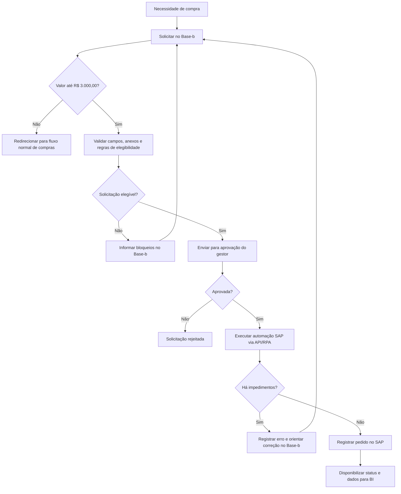

# PRD - SESI | MVP Pequenas Compras

**Status:** versão inicial para validação  
**Data:** 2026-06-08  
**Produto:** automação de Pequenas Compras no Base-b  
**Cliente:** SESI  
**Escopo:** MVP de Pequenas Compras, não o programa completo de 10 protótipos e 4 MVPs

## 1. Fontes e premissas

Este PRD consolida exclusivamente os anexos fornecidos:

- `01. Relatório de Benchmarking - Automações na área de Compras.pdf`
- `02. Desenho do processo na empresa parceira.png`
- `03. Relatório inicial para o mapeamento das automações - Pequenas Compras.pdf`

Premissas adotadas:

- A empresa parceira deve permanecer anônima em todos os artefatos do projeto.
- O Base-b será o ponto de entrada das solicitações de pequenas compras, assumindo papel equivalente ao SDM observado no benchmarking.
- O limite inicial para pequenas compras será de até `R$ 3.000,00`, configurável até confirmação final do SESI.
- O MVP deve validar regras no Base-b, conduzir aprovação e tentar registrar pedidos elegíveis no SAP via API, RPA, Power Automate, Python ou solução equivalente aprovada por TI.
- A viabilidade das APIs do Base-b, SAP e sistemas conectados é dependência técnica a ser confirmada por TI.
- Não será incluída coleta automática de preços na internet no MVP; essa possibilidade fica como evolução futura por envolver riscos de compliance e validade das evidências.

## 2. Contexto

O SESI está avaliando oportunidades de automação para reduzir esforço operacional, padronizar processos e reforçar compliance na área de Compras.

No benchmarking, foi observada uma solução chamada Direct Buy, usada por uma empresa parceira para automatizar compras de pequeno valor. O modelo retira da área de Compras a carga operacional de pedidos pulverizados e repetitivos, como coffee break, itens de escritório e manutenções simples.

No processo observado, o requisitante não precisa acessar o SAP. Ele abre uma solicitação em um sistema intermediário de chamados. Depois da aprovação do gestor, um robô verifica as solicitações elegíveis, aplica regras de governança e registra o pedido no SAP quando não há impedimentos.

Para o SESI, o relatório inicial indica que o Base-b já participa do processo de pequenas compras e deve ser analisado como sistema de entrada, validação e automação.

## 3. Problema

O processo de pequenas compras tende a gerar alto volume de solicitações de baixo valor, com esforço operacional desproporcional para Suprimentos e Compras.

Sem automação e regras sistêmicas, há risco de:

- dependência da memória do comprador para aplicar regras de negócio;
- retrabalho por campos incompletos, anexos ausentes ou dados inconsistentes;
- baixa rastreabilidade de alterações e decisões;
- compras fora de política;
- uso de fornecedores bloqueados, não homologados ou sem evidência adequada;
- tentativa de fracionamento para burlar limite de valor;
- sobrecarga da equipe de Compras com demandas repetitivas, em vez de compras estratégicas.

## 4. Objetivos

### Objetivos do MVP

- Automatizar a triagem de solicitações de pequenas compras no Base-b.
- Aplicar regras de enquadramento, compliance e elegibilidade antes do envio ao SAP.
- Reduzir intervenção manual da área de Compras em solicitações simples e repetitivas.
- Garantir rastreabilidade por logs automáticos de auditoria.
- Permitir correção pelo requisitante quando houver impedimentos claros.
- Registrar automaticamente no SAP os pedidos aprovados e elegíveis, quando tecnicamente viável.
- Gerar indicadores mínimos para acompanhamento de volume, SLA, erros, bloqueios e ganho operacional.

### Fora do escopo do MVP

- Criar um PRD guarda-chuva para todos os 10 protótipos e 4 MVPs do programa.
- Automatizar busca de preços na internet.
- Substituir o fluxo normal de compras acima do limite configurado.
- Definir penalidades automáticas para tentativa de fracionamento sem política formal do SESI.
- Implementar BI avançado, auditoria online em tempo real ou premiação de equipes.
- Homologar fornecedores dentro do MVP, salvo se o processo atual do SESI já permitir essa ação no Base-b ou em sistema integrado.

## 5. Personas e stakeholders

| Perfil | Necessidade principal | Papel no MVP |
| --- | --- | --- |
| Requisitante | Solicitar compra simples sem acessar SAP e receber retorno claro sobre pendências | Preenche solicitação, anexa evidências, corrige impedimentos |
| Gestor aprovador | Validar necessidade, orçamento e conformidade básica | Aprova ou reprova solicitação antes da automação SAP |
| Comprador / Suprimentos | Reduzir trabalho operacional e atuar em exceções ou compras estratégicas | Define regras, acompanha exceções e monitora indicadores |
| TI SESI | Avaliar APIs, RPA, infraestrutura, segurança e sustentação | Define arquitetura técnica e integrações |
| Compliance / Auditoria | Garantir política de compras, rastreabilidade e prevenção de fraude | Consulta logs, regras, bloqueios e justificativas |
| Fornecedor | Receber pedido formalizado e acompanhar processo quando aplicável | Participa indiretamente via cadastro/homologação e evidências |

## 6. Visão da solução

O MVP será uma camada de automação e governança no fluxo de pequenas compras do Base-b.

O Base-b deve:

- receber a solicitação;
- reaproveitar ou preencher automaticamente campos conhecidos quando possível;
- validar campos e documentos obrigatórios;
- classificar se a solicitação se enquadra como pequena compra;
- aplicar regras de compliance;
- encaminhar para aprovação;
- enviar solicitações aprovadas e elegíveis para automação de registro no SAP;
- registrar logs e mensagens de retorno;
- disponibilizar dados mínimos para BI.

O SAP permanece como sistema de registro formal do pedido de compra. A automação deve atuar como ponte entre Base-b e SAP, sem exigir que o requisitante acesse o SAP.

## 7. Fluxo To Be



## 8. Requisitos funcionais

| ID | Requisito | Prioridade |
| --- | --- | --- |
| RF-01 | Permitir abertura de solicitação de pequena compra no Base-b. | Must |
| RF-02 | Classificar automaticamente se a solicitação está dentro do limite configurado para pequenas compras. | Must |
| RF-03 | Redirecionar solicitações acima do limite para o fluxo normal de compras. | Must |
| RF-04 | Reaproveitar ou preencher automaticamente campos já disponíveis em bases internas, como centro de custo, unidade e natureza do objeto, quando houver fonte confiável. | Should |
| RF-05 | Manter preenchimento manual de campos que exigem contexto do requisitante, como justificativa da compra. | Must |
| RF-06 | Validar automaticamente campos obrigatórios, urgência, número mínimo de fornecedores e anexos exigidos. | Must |
| RF-07 | Validar se o fornecedor está homologado, bloqueado ou inexistente na base. | Must |
| RF-08 | Bloquear fornecedor bloqueado e registrar motivo para o requisitante e auditoria. | Must |
| RF-09 | Validar se o item é material de estoque. | Must |
| RF-10 | Validar se o item possui contrato vigente. | Must |
| RF-11 | Validar tentativa de fracionamento de compras para burlar o limite configurado. | Must |
| RF-12 | Exigir justificativa quando o fornecedor escolhido não for o de menor preço. | Must |
| RF-13 | Permitir fluxo com fornecedor homologado, seguindo o modelo de cotação automática definido para o Base-b. | Must |
| RF-14 | Permitir fluxo de exceção quando não houver fornecedor homologado, com inserção de até 3 preços obtidos por internet ou prospecção rápida. | Must |
| RF-15 | Exigir evidência anexada para cada fornecedor ou preço informado no fluxo de exceção. | Must |
| RF-16 | Registrar data e hora da coleta de preço no fluxo de exceção. | Must |
| RF-17 | Enviar solicitação elegível para aprovação do gestor. | Must |
| RF-18 | Após aprovação, tentar registrar automaticamente o pedido no SAP via API, RPA ou alternativa aprovada por TI. | Must |
| RF-19 | Em caso de erro ou impedimento na automação SAP, atualizar a solicitação no Base-b com mensagem acionável para correção. | Must |
| RF-20 | Registrar pedido como concluído no Base-b quando o SAP confirmar criação do pedido. | Must |
| RF-21 | Criar logs automáticos de auditoria para alterações, validações, bloqueios, aprovações, tentativas de integração e criação de pedido. | Must |
| RF-22 | Disponibilizar dados mínimos para BI operacional e gestão da rotina. | Must |
| RF-23 | Permitir configuração de regras críticas, como limite de valor, quantidade mínima de cotações e critérios de elegibilidade. | Should |

## 9. Regras de negócio

| ID | Regra | Resultado esperado |
| --- | --- | --- |
| RN-01 | Solicitações com valor maior que o limite configurado não são processadas pelo fluxo de pequenas compras. | Redirecionar para fluxo normal de compras. |
| RN-02 | O limite inicial do MVP é `R$ 3.000,00`. | Aplicar automaticamente no Base-b. |
| RN-03 | Centro de custo deve estar correto e validado. | Bloquear ou solicitar correção quando inválido. |
| RN-04 | Unidade e natureza do objeto devem estar preenchidas e consistentes. | Bloquear ou solicitar correção quando inválidas. |
| RN-05 | Justificativa da compra é obrigatória e permanece manual. | Não permitir avanço sem justificativa. |
| RN-06 | Fornecedor bloqueado não pode gerar pedido automatizado. | Rejeitar ou bloquear solicitação com motivo claro. |
| RN-07 | Fornecedor não homologado exige fluxo de exceção ou aprovação prévia, conforme política final do SESI. | Impedir automação direta. |
| RN-08 | Item de estoque não deve seguir pelo fluxo automatizado de pequena compra. | Bloquear ou redirecionar conforme regra de Suprimentos. |
| RN-09 | Item com contrato vigente não deve seguir pelo fluxo automatizado de pequena compra. | Bloquear ou redirecionar para contrato existente. |
| RN-10 | Tentativa de fracionamento deve ser identificada, bloqueada e registrada. | Não gerar pedido; registrar log para auditoria. |
| RN-11 | Deve existir evidência para cada cotação ou preço informado. | Bloquear avanço se anexo estiver ausente. |
| RN-12 | Se o fornecedor escolhido não tiver menor preço, a justificativa é obrigatória. | Bloquear avanço sem justificativa. |
| RN-13 | Solicitações aprovadas e sem impedimento devem ser enviadas para registro no SAP. | Criar pedido ou registrar erro técnico acionável. |
| RN-14 | Erros da automação devem retornar ao Base-b com motivo compreensível. | Permitir correção pelo requisitante ou intervenção de Compras/TI. |

## 10. Dados e campos

### Campos que podem ser automatizados ou reaproveitados

- Centro de custo.
- Unidade.
- Natureza do objeto.
- Dados de fornecedor homologado, quando disponíveis.
- Status de bloqueio do fornecedor.
- Indicativo de item de estoque.
- Indicativo de contrato vigente.

### Campos que exigem validação automática

- Valor total da solicitação.
- Urgência.
- Número mínimo de fornecedores/cotações.
- Anexos obrigatórios.
- Evidência por fornecedor/preço.
- Data e hora da coleta de preço.
- Justificativa para escolha fora do menor preço.

### Campos que devem permanecer manuais

- Justificativa da compra.
- Descrição contextual da necessidade.
- Evidências externas obtidas pelo requisitante ou comprador no fluxo sem fornecedor homologado.

## 11. Integrações e interfaces conceituais

| Interface | Finalidade | Dependência |
| --- | --- | --- |
| Base-b | Entrada, validação, workflow, mensagens de erro, status e logs da solicitação. | Mapeamento de campos e regras processuais. |
| SAP | Registro formal do pedido de compra. | Estudo de API, RPA ou alternativa aprovada por TI. |
| Cadastro de fornecedores | Validar fornecedor homologado, bloqueado ou inexistente. | Disponibilidade e atualização da base. |
| Base de contratos | Identificar contrato vigente para o item/material. | Fonte confiável e integração com Base-b ou motor de regras. |
| Base de estoque | Identificar item de estoque. | Fonte confiável e integração com Base-b ou motor de regras. |
| Motor de regras | Centralizar regras de enquadramento, elegibilidade e compliance. | Definição de Suprimentos, Processos e TI. |
| Logs de auditoria | Registrar alterações, validações, bloqueios e integrações. | Modelo mínimo de eventos e retenção. |
| BI | Monitorar operação, automação e ganhos. | Disponibilização dos dados do Base-b, SAP e logs. |

## 12. Requisitos não funcionais

| ID | Requisito | Critério |
| --- | --- | --- |
| RNF-01 | Rastreabilidade | Toda alteração relevante deve registrar usuário, data/hora, campo alterado, valor anterior quando aplicável, novo valor e origem da ação. |
| RNF-02 | Auditabilidade | Bloqueios, aprovações, justificativas e tentativas de integração devem ser consultáveis para auditoria. |
| RNF-03 | Segurança | O requisitante não deve precisar acessar diretamente o SAP para solicitar pequenas compras. |
| RNF-04 | Configurabilidade | Limite de valor e regras críticas devem poder ser ajustados sem depender de alteração estrutural do processo. |
| RNF-05 | Clareza de erro | Mensagens de bloqueio devem orientar ação corretiva, não apenas indicar falha genérica. |
| RNF-06 | Integridade de dados | A automação não deve criar pedido no SAP quando houver divergência de fornecedor, item, valor, anexo ou aprovação. |
| RNF-07 | Sustentabilidade técnica | A solução deve considerar capacidade de manutenção por TI e Suprimentos. |
| RNF-08 | Monitoramento | Erros de automação, tempo de processamento e volume por status devem alimentar BI mínimo. |

## 13. Métricas e BI mínimo

O MVP deve disponibilizar indicadores para gestão da rotina e melhoria contínua:

- volume de solicitações de pequenas compras;
- percentual de solicitações elegíveis;
- percentual de solicitações bloqueadas por regra;
- principais motivos de bloqueio;
- quantidade de solicitações aprovadas;
- quantidade de pedidos registrados no SAP;
- erros de automação SAP;
- SLA médio da solicitação até aprovação;
- SLA médio da aprovação até registro no SAP;
- retrabalho por correção de chamado/solicitação;
- ganho operacional estimado para Compras/Suprimentos;
- distribuição por unidade, centro de custo, natureza do objeto e fornecedor.

## 14. Critérios de aceite

O MVP será considerado aceito quando:

- Uma solicitação de até `R$ 3.000,00`, com fornecedor homologado, anexos válidos e aprovação concluída, conseguir avançar para tentativa de criação de pedido no SAP.
- Solicitações acima do limite forem redirecionadas ao fluxo normal de compras.
- Solicitações com fornecedor bloqueado, item de estoque ou contrato vigente forem impedidas de seguir pela automação.
- O Base-b impedir avanço quando anexos obrigatórios ou cotações mínimas estiverem ausentes.
- A escolha de fornecedor que não seja o menor preço exigir justificativa.
- O fluxo sem fornecedor homologado permitir registro de até 3 preços com evidências e data/hora da coleta.
- Erros de integração SAP retornarem ao Base-b com mensagem clara e acionável.
- Tentativas de fracionamento forem bloqueadas e registradas para auditoria.
- Logs mínimos registrarem alterações, aprovações, bloqueios, mensagens de erro e tentativas de automação.
- BI mínimo exibir volume, SLA, erros, pedidos registrados, bloqueios por regra e ganho operacional estimado.

## 15. Cenários de teste

| ID | Cenário | Resultado esperado |
| --- | --- | --- |
| CT-01 | Solicitação elegível até `R$ 3.000,00`, fornecedor homologado, aprovação concluída. | Pedido é enviado para criação no SAP e status é atualizado no Base-b. |
| CT-02 | Solicitação acima de `R$ 3.000,00`. | Solicitação é redirecionada para fluxo normal de compras. |
| CT-03 | Fornecedor está bloqueado. | Solicitação é bloqueada, motivo é exibido e log é criado. |
| CT-04 | Item é material de estoque. | Solicitação é bloqueada ou redirecionada conforme regra de Suprimentos. |
| CT-05 | Item possui contrato vigente. | Solicitação é bloqueada ou redirecionada ao contrato existente. |
| CT-06 | Solicitação sem anexo obrigatório. | Base-b impede avanço e informa pendência. |
| CT-07 | Quantidade mínima de cotações não atendida. | Base-b impede avanço e informa pendência. |
| CT-08 | Fornecedor escolhido não é o menor preço e justificativa está ausente. | Base-b impede avanço até justificativa ser preenchida. |
| CT-09 | Não há fornecedor homologado. | Fluxo de exceção exige até 3 preços, evidências e data/hora de coleta. |
| CT-10 | Integração SAP retorna erro. | Base-b mostra mensagem acionável, registra log e permite correção ou intervenção. |
| CT-11 | Tentativa de fracionamento identificada. | Solicitação é bloqueada e evento é registrado para auditoria. |
| CT-12 | Solicitação corrigida após bloqueio. | Processo retorna à etapa adequada sem perder histórico de auditoria. |

## 16. Riscos e pontos de atenção

| Risco | Impacto | Mitigação |
| --- | --- | --- |
| APIs do Base-b ou SAP sem maturidade suficiente | Atraso ou limitação da automação fim a fim | Estudo técnico antecipado e fallback com RPA, Power Automate, Python ou solução aprovada. |
| Regras de negócio incompletas | Automação pode liberar compras fora de política | Mapear regras com Processos e Suprimentos antes do piloto. |
| Cadastros de fornecedores, contratos ou estoque desatualizados | Bloqueios indevidos ou compras incorretas | Definir responsável e rotina de atualização de bases. |
| Dados manuais de baixa qualidade | Retrabalho e falhas de compliance | Validações obrigatórias, mensagens claras e logs. |
| Resistência à descentralização de pequenas compras | Baixa adoção do MVP | Piloto controlado, comunicação clara e acompanhamento de indicadores. |
| Dependência excessiva de uma solução técnica específica | Dificuldade de sustentação | Comparar API, RPA e ferramentas Microsoft disponíveis no ambiente SESI. |
| Fracionamento de compras | Risco de fraude ou burla de política | Regra automática de detecção, bloqueio e auditoria. |

## 17. Roadmap sugerido

### Fase 1 - Descoberta e desenho

- Aprofundar mapeamento dos campos do Base-b.
- Indicar campos que serão automatizados, validados ou mantidos manuais.
- Definir requisitos processuais para cada campo.
- Definir regras de negócio com Suprimentos e Processos.
- Estudar APIs e alternativas técnicas com TI.

### Fase 2 - MVP piloto

- Implementar triagem de limite e elegibilidade.
- Implementar validações de campos, anexos, fornecedores, estoque, contratos e fracionamento.
- Implementar fluxo de aprovação.
- Implementar tentativa de criação de pedido no SAP.
- Implementar retorno de erro ao Base-b.
- Implementar logs de auditoria.
- Implementar BI mínimo.

### Fase 3 - Evolução

- Expandir regras e unidades após validação do piloto.
- Refinar indicadores e painéis de gestão.
- Avaliar portal ou interface de acompanhamento para fornecedores, requisitantes e compradores.
- Avaliar automação assistida de pesquisa de preços online, somente após definição de compliance.
- Evoluir para auditoria preventiva em tempo real, se aderente ao ambiente SESI.

## 18. Estratégia técnica e handoff

Esta seção define a base técnica recomendada para transformar o PRD em protótipo/MVP no repositório `V2PequenasCompras`, reaproveitando o máximo do template shadcn-admin e mantendo o código previsível para handoff.

### Stack decidida para o MVP

| Camada | Decisão | Status |
| --- | --- | --- |
| Front-end | Vite + React + TypeScript. | Decidida pelo template. |
| UI | shadcn/ui + Tailwind CSS. | Decidida pelo template. |
| Layout base | shadcn-admin com sidebar, header, command menu, tabelas, drawers, settings e páginas de erro. | Decidida pelo template. |
| Rotas | TanStack Router com file-based routes e validação de search params. | Decidida pelo template. |
| Tabelas | TanStack Table para listagem, filtros, paginação, seleção e colunas reutilizáveis. | Decidida pelo template. |
| Validação | Zod para schemas de domínio, formulários e parâmetros de rota. | Assumida para consistência técnica. |
| Data fetching futuro | TanStack Query quando o MVP sair de mocks e consumir APIs reais. | A validar com arquitetura de TI. |
| Testes | Vitest para unidade/componentes e Playwright para fluxos críticos no navegador. | Assumida para handoff. |
| Deploy | Vercel servindo build estático Vite. | Assumida para protótipo/MVP. |

### Padrões de código

- O domínio principal deve ficar em `src/features/purchase-requests`, substituindo gradualmente a feature genérica `tasks`.
- Nomes de interface devem aparecer em português para usuários: `Solicitações`, `Aprovações`, `Pendências`, `Auditoria`, `Integrações`, `Indicadores`, `Configurações`.
- Nomes técnicos no código devem permanecer em inglês e consistentes: `PurchaseRequest`, `Quote`, `ComplianceCheck`, `AuditLog`, `IntegrationEvent`.
- Schemas Zod devem ser a fonte de verdade para tipos inferidos, validações de formulário e validações de search params.
- Estados de solicitação devem ser representados por unions/discriminants, evitando strings soltas espalhadas pela UI.
- Dados derivados devem ser calculados no render ou por seletores/helpers, evitando `useEffect` para sincronizar estado duplicado.
- Tabelas devem reaproveitar os componentes existentes de data table, com filtros e paginação refletidos na URL quando fizer sentido.
- Componentes shadcn existentes devem ser compostos antes de criar marcação customizada.
- O preset `b5dyXAABk` deve ser aplicado apenas em tema e fonte:

```bash
pnpm dlx shadcn@latest apply --preset b5dyXAABk --only theme
pnpm dlx shadcn@latest apply --preset b5dyXAABk --only font
```

### Mapa de telas para implementação

| Tela | Origem no template | Objetivo no MVP |
| --- | --- | --- |
| Dashboard | `features/dashboard` | KPIs de volume, SLA, pedidos SAP, bloqueios, erros e ganho operacional. |
| Solicitações | `features/tasks` | Fila principal de pequenas compras com filtros por status, unidade, valor, fornecedor e pendência. |
| Nova Solicitação | Novo fluxo em `purchase-requests` | Formulário de abertura com dados da compra, fornecedor, cotações, anexos e justificativa. |
| Detalhe da Solicitação | Novo fluxo em `purchase-requests` | Visão por abas: dados, cotações, validações, aprovação, SAP e auditoria. |
| Aprovações | Derivado de `purchase-requests` | Lista de solicitações aguardando decisão do gestor. |
| Pendências | Derivado de `purchase-requests` | Solicitações bloqueadas ou aguardando correção do requisitante. |
| Auditoria | Novo módulo | Logs de alteração, validação, bloqueio, aprovação e integração SAP. |
| Integrações | Adaptar `features/apps` | Status conceitual de Base-b, SAP, fornecedores, contratos, estoque e BI. |
| Configurações | Adaptar `features/settings` | Parâmetros de limite, cotações, SLAs, mensagens e regras configuráveis. |

### Critérios de handoff para desenvolvedor

- Cada feature deve ter `data`, `components`, `schemas` e `index.tsx` quando aplicável.
- Mocks devem ser tipados e próximos dos cenários do PRD, sem dados genéricos do template.
- Cada regra de compliance exibida ao usuário deve ter ID, resultado, severidade e mensagem acionável.
- Toda ação destrutiva ou irreversível deve usar confirmação acessível.
- Tests devem preferir seletores semânticos por role, label ou texto visível, não seletores CSS frágeis.
- Antes de entregar para deploy, o projeto deve passar por `pnpm run build`, `pnpm run lint` e smoke test visual em desktop/mobile.
- Para Vercel com Vite SPA, o projeto deve ter rewrite para `index.html` quando usar rotas client-side profundas.

## 19. Fontes Context7 para implementação limpa

As fontes abaixo devem orientar o código e revisões técnicas. Elas não substituem os anexos SESI como fonte de negócio.

### Fontes primárias

| Context7 ID | Uso no projeto |
| --- | --- |
| `/shadcn-ui/ui` e `/websites/ui_shadcn` | Presets, tema, fonte, componentes, composição e CLI shadcn. |
| `/tailwindlabs/tailwindcss.com` ou `/websites/tailwindcss` | Tokens, variáveis de tema, responsividade e utilitários. |
| `/reactjs/react.dev` ou `/websites/react_dev` | Componentização, estado mínimo, estado derivado e uso criterioso de effects. |
| `/vitejs/vite` | Build estático, estrutura de SPA e saída `dist`. |
| `/tanstack/router` | Rotas, search params e validação de parâmetros. |
| `/tanstack/query` | Queries, mutations e invalidação quando houver APIs reais. |
| `/microsoft/typescript` | Tipos de domínio, unions e contratos de dados. |
| `/colinhacks/zod` | Schemas, `safeParse`, mensagens de erro e inferência de tipos. |
| `/vitest-dev/vitest` | Testes de unidade e componentes em browser mode. |
| `/microsoft/playwright` | Smoke tests e fluxos críticos com locators semânticos. |
| `/websites/vercel` | Deploy Vite SPA e `vercel.json` com rewrites. |

### Fontes secundárias

| Context7 ID | Quando consultar |
| --- | --- |
| `/better-auth/better-auth` | Se o MVP exigir autenticação própria. |
| `/clerk/clerk-docs` | Se a autenticação parcial do template for mantida/adaptada. |
| `/supabase/supabase` e `/supabase/supabase-js` | Se mocks evoluírem para backend Supabase. |
| `/drizzle-team/drizzle-orm-docs` ou `/prisma/docs` | Se houver banco relacional com ORM. |
| `/n8n-io/n8n-docs` | Se n8n for escolhido para automação/workflow. |
| `/modelcontextprotocol/typescript-sdk` | Se o produto ganhar integrações MCP. |

### Fontes fora do MVP atual

- `/vercel/next.js`, porque o projeto base é Vite.
- `/remix-run/react-router`, porque o template usa TanStack Router.
- `/vercel/ai`, `/websites/ai-sdk_dev`, `/openai/openai-python`, `/websites/platform_openai`, `/langchain-ai/langgraph` e `/mastra-ai/mastra`, porque não há feature de IA no PRD atual.
- `/fastapi/fastapi`, `/nestjs/docs.nestjs.com` e `/spring-projects/spring-boot`, porque backend ainda não foi escolhido.
- `/mongodb/docs`, `/payloadcms/payload`, `/websites/stripe`, `/expo/expo` e `/websites/developer_apple_swiftui`, por estarem fora do escopo do MVP.
- `/anthropics/claude-code`, `/websites/code_claude`, `/openclaw/openclaw` e `/anomalyco/opencode`, por serem úteis para workflow de agentes, não para arquitetura do app.

## 20. Critérios técnicos de aceite

- O app deve manter arquitetura Vite + React + TanStack Router, sem migração para Next.js no MVP.
- O build de produção deve gerar a saída estática esperada em `dist`.
- Rotas com filtros devem validar search params antes de consumo pela UI.
- Formulários de solicitação devem validar dados com Zod antes de persistir mock/API.
- Tabelas devem manter filtros, paginação e seleção previsíveis.
- O tema claro/escuro deve manter contraste, hierarquia e legibilidade equivalentes.
- O deploy Vercel deve suportar refresh em rotas internas por rewrite para `index.html`.
- Testes de fluxo devem usar locators semânticos, como role e label, para reduzir fragilidade.
- O handoff deve evitar dependências sem uso, CSS solto desnecessário e duplicação de estado.

## 21. Pendências para confirmação

- Limite final de pequenas compras no SESI.
- Política formal para fornecedor não homologado.
- Quantidade mínima definitiva de cotações por cenário.
- Fonte oficial de dados para fornecedores, contratos e estoque.
- Modelo de detecção de fracionamento.
- SLA esperado para aprovação e registro no SAP.
- Frequência de execução da automação SAP.
- Estratégia técnica escolhida: API, RPA, Power Automate, Python ou alternativa híbrida.
- Responsáveis e prazos das próximas etapas de Processos, Suprimentos e TI.
